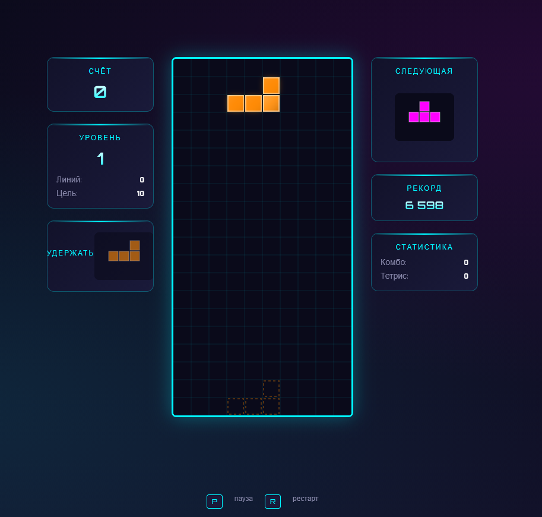

# 🎮 Block Puzzle Master

Классическая головоломка с падающими блоками и современным дизайном.



## 🚀 Быстрый старт

Откройте `index.html` в любом современном браузере.

```bash
# Или используйте локальный сервер
python -m http.server 8000
# Перейдите на http://localhost:8000
```

## 🎯 Режимы игры

| Режим | Описание |
|-------|----------|
| **Марафон** | Бесконечная игра с нарастающей скоростью. Цель — набрать максимум очков |
| **Спринт** | Нужно очистить 40 линий как можно быстрее |
| **Ультра** | Набрать 100,000 очков за 3 минуты |

## 🕹️ Управление

| Клавиша | Действие |
|---------|----------|
| `←` `→` | Движение фигуры влево/вправо |
| `↑` | Поворот по часовой стрелке |
| `↓` | Мягкое падение (ускорение) |
| `Space` | Жёсткое падение (мгновенно) |
| `C` / `Shift` | Удержать фигуру |
| `P` | Пауза |
| `R` | Рестарт |

## ⚡ Механики

### Система удержания (Hold)
- Нажмите `C` чтобы отложить текущую фигуру
- Удержанную фигуру можно выпустить позже
- Можно использовать только один раз за текущую фигуру

### Ghost-блок
- Показывает место приземления фигуры
- Пунктирная линия указывает точное положение

### DAS (Delayed Auto Shift)
- Удерживайте направление для быстрого перемещения
- Задержка 170мс, затем повтор 50мс

### Система очков

| Очищено линий | Очки |
|---------------|------|
| 1 | 100 × уровень |
| 2 | 300 × уровень |
| 3 | 500 × уровень |
| 4 (4-линии) | 800 × уровень |

### Система уровней
- Уровень повышается каждые 10 линий (марафон)
- Скорость падения увеличивается с каждым уровнем
- Максимальная скорость достигается на высоких уровнях

### Комбо-система
- Очистка линий подряд даёт комбо-бонус
- Каждое комбо увеличивает множитель очков
- Пропуск очистки сбрасывает комбо

## 📊 Статистика

- **Счёт** — текущие очки
- **Уровень** — текущий уровень сложности
- **Линии** — количество очищенных линий
- **Удержать** — сохранённая фигура
- **Следующая** — следующая фигура в очереди
- **Рекорд** — лучший результат (сохраняется локально)

## 🎨 Визуальные эффекты

- Частицы при блокировке фигуры
- Взрыв частиц при очистке линий
- Анимации комбо и повышения уровня
- Свечение активных фигур
- Ghost-блок для точного позиционирования

## 💾 Сохранение

Лучший результат автоматически сохраняется в браузере (localStorage).

## 🛠️ Технологии

- HTML5 Canvas
- Vanilla JavaScript (ES6+)
- CSS3 с анимациями
- Google Fonts (Orbitron, Rajdhani)

## 📄 Лицензия

MIT License
